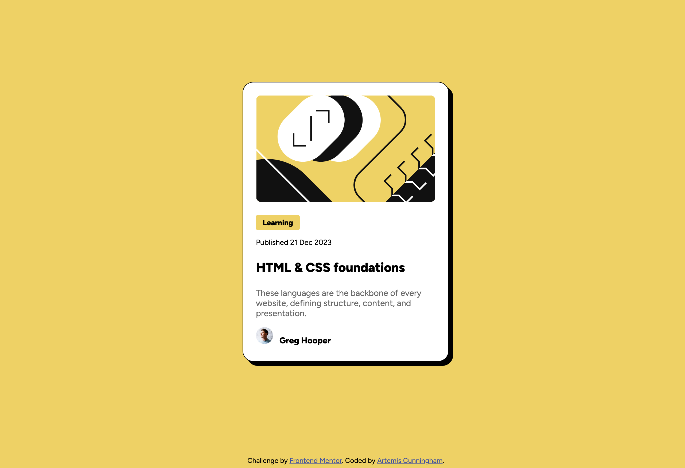

# Frontend Mentor - Blog preview card solution

This is a solution to the [Blog preview card challenge on Frontend Mentor](https://www.frontendmentor.io/challenges/blog-preview-card-ckPaj01IcS). Frontend Mentor challenges help you improve your coding skills by building realistic projects.

## Table of contents

- [Overview](#overview)
  - [The challenge](#the-challenge)
  - [Screenshot](#screenshot)
  - [Links](#links)
- [My process](#my-process)
  - [Built with](#built-with)
  - [What I learned](#what-i-learned)
  - [Useful resources](#useful-resources)

## Overview

### The challenge

Users should be able to:

- See hover and focus states for all interactive elements on the page

### Screenshot



### Links

- Solution URL: [Frontend Mentor Solution](https://www.frontendmentor.io/solutions/blog-preview-card-using-flexbox-of1QgyBjBB)
- Live Site URL: [Vercel Live Site](https://fem-blog-card-eight.vercel.app/)

## My process

### Built with

- Semantic HTML5 markup
- CSS custom properties
- Flexbox

### What I learned

```css
.card:hover {
  filter: drop-shadow(16px 16px);
}
```

### Useful resources

- [CSS Tricks Flexbox Guide](https://css-tricks.com/snippets/css/a-guide-to-flexbox/) - This guide was very useful in cementing my understanding of Flexbox, since I used it a lot in completing the design for this project.
- [MDN :hover Article](https://developer.mozilla.org/en-US/docs/Web/CSS/:hover) - This article helped me add the hover states in the project.

## Author

- Frontend Mentor - [@outerspaceartie](https://www.frontendmentor.io/profile/outerspaceartie)
